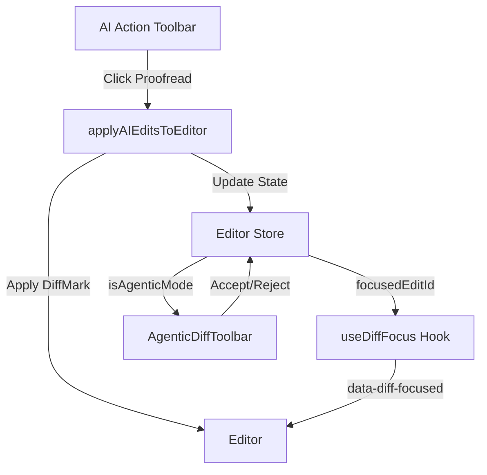

# Scrap Sheet

A modern, local-first writing assistant with AI-powered editing capabilities. Built with Next.js, Tiptap/Novel editor, and Triplit for offline-first data persistence.

## Features

### Core Editor
- **Rich Text Editing** — Powered by Tiptap/Novel with full formatting support
- **Local-First Storage** — Uses Triplit with IndexedDB for offline-capable document storage
- **Version History** — Automatic versioning with ability to browse and restore previous versions
- **Auto-Save** — Debounced autosave with visual feedback

### Agentic AI Editing
- **Diff-Based Suggestions** — AI-suggested edits displayed as inline diffs (green for additions, red strikethrough for deletions)
- **Accept/Reject Workflow** — Review each suggestion individually with Accept (✓) or Reject (✕) buttons
- **Batch Operations** — Accept All or Reject All for quick processing
- **Navigation** — Arrow controls to jump between pending edits with visual focus highlighting
- **Code-Editor Styling** — VS Code-inspired diff coloring for clear visual distinction

### AI Tools
- **Proofread** — Spelling and grammar corrections
- **Grammar** — Grammar-focused improvements
- **Paraphrase** — Alternative phrasing suggestions

## Tech Stack

- **Framework**: Next.js 16 (App Router)
- **Editor**: Tiptap via Novel.sh
- **Database**: Triplit (local-first, IndexedDB)
- **State Management**: Zustand
- **Styling**: Tailwind CSS
- **UI Components**: Shadcn UI
- **Icons**: Hugeicons
- **Animations**: Framer Motion

## Getting Started

```bash
# Install dependencies
pnpm install

# Run development server
pnpm dev
```

Open [http://localhost:3000](http://localhost:3000) to access the app.

## Project Structure

```
├── app/                    # Next.js App Router pages
│   ├── dashboard/          # Document list view
│   └── editor/[id]/        # Individual document editor
├── components/
│   ├── editor/             # Editor components
│   │   ├── extensions/     # Custom Tiptap extensions (DiffMark)
│   │   ├── agentic-diff-toolbar.tsx
│   │   ├── ai-action-toolbar.tsx
│   │   └── ai-input-bar.tsx
│   └── ui/                 # Shadcn UI components
├── lib/
│   ├── ai/                 # AI editing utilities
│   │   ├── agentic-editor-utils.ts
│   │   └── mock-ai-edits.ts
│   ├── hooks/              # Custom React hooks
│   └── store/              # Zustand stores
└── triplit/                # Database schema and client
```

## Development

### Seeding Demo Data

The dashboard automatically seeds a demo document on first load for testing the AI editing features.

### Testing AI Editing

1. Open the demo document from the dashboard
2. Click "Proofread" in the AI Action Toolbar
3. Review the diff highlights (red = original, green = suggestion)
4. Use Accept/Reject to process individual edits
5. Use navigation arrows to jump between edits

## Architecture



## License

MIT
